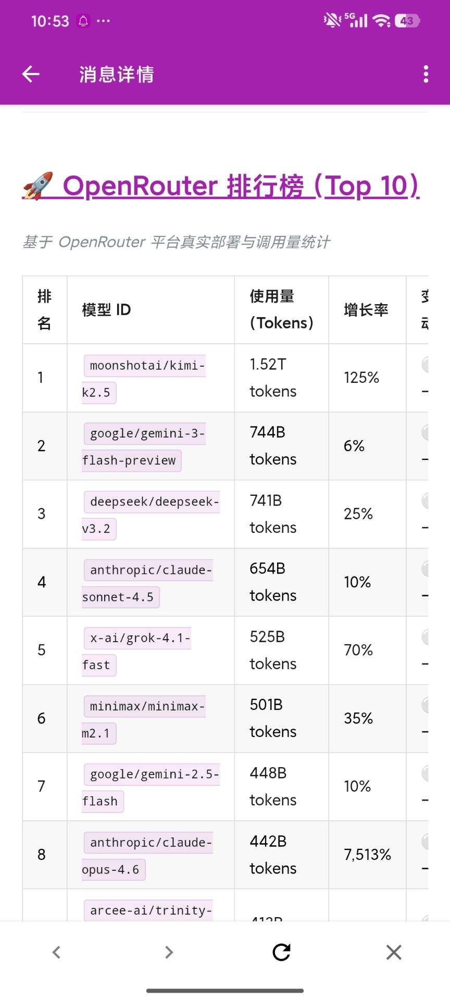
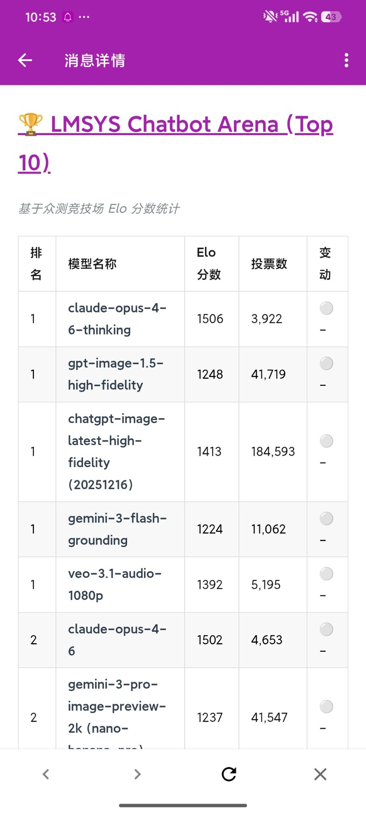
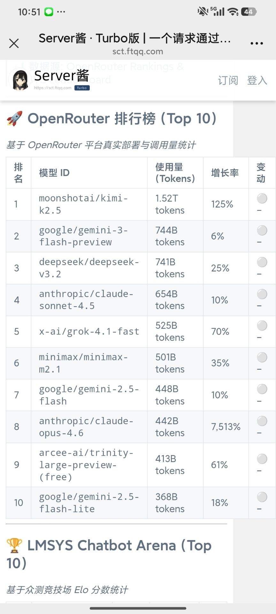

# LLM Trend Observer (大模型趋势观察者) 🚀

这是一个自动化的大模型排行榜监测系统，能够持续抓取业界最权威的 **LMSYS Chatbot Arena** 和 **OpenRouter Rankings** 数据，自动计算排名变化，并于**每天北京时间 08:00** 准时推送到你的移动设备（微信/手机 App）。

---

## 📱 推送效果展示

为了让你第一时间掌握大模型界的“风吹草动”，系统支持美观的 Markdown 报告推送（支持微信、App、浏览器多端同步）：

### 推送效果图
| WXPusher 移动端展示 (1) | WXPusher 移动端展示 (2) | Server酱 (方糖) 展示 |
| :---: | :---: | :---: |
|  |  |  |

---

## 🏆 报告示例

生成的报告包含详细的排名、Token 使用量、Elo 分数及变动 Delta：

> ### 🤖 LLM 趋势观察技术报告 (示例)
> 📊 **数据源**: [OpenRouter](https://openrouter.ai/rankings) & [LMSYS](https://lmarena.ai/leaderboard)
> 
> | 排名 | 模型 ID / 名称 | 指标 (Tokens/Elo) | 变动 |
> | :--- | :--- | :--- | :--- |
> | 1 | `moonshotai/kimi-k2.5` | 1.52T tokens | ⚪ - | 
> | 2 | `google/gemini-3-flash-preview` | 744B tokens | 🟢 ↑1 | 
> | 3 | `anthropic/claude-sonnet-4.5` | 654B tokens | 🔴 ↓1 | 
> | 4 | `deepseek/deepseek-v3.2` | 741B tokens | ⚪ - | 
> | 5 | `claude-opus-4-6-thinking` | 1506 Elo | ⚪ - | 
> | 6 | `gpt-image-1.5-high-fidelity` | 1248 Elo | 🟢 ↑2 | 
>
> *更多详细数据可在推送消息中点击直达...*

---

## 📢 如何接收推送 (推荐 WXPusher)

由于 **WXPusher** 支持更丰富的卡片展示且配置后无需后续干预，推荐所有用户使用此方案。

### 第一步：点击链接关注订阅
点击下方链接，使用微信扫码关注【大模型今日趋势报告】主题：

👉 [**点击此处进行订阅**](https://wxpusher.zjiecode.com/wxuser/?type=2&id=43364#/follow)

### 第二步：安装 App 确保实时到达
1. 在应用市场搜索并下载 **WxPusher消息推送平台**。
2. 使用**微信登录**。
3. 进入 App 后，点击右上角三个点 -> **“订阅管理”**，确认列表中包含 **大模型今日趋势报告**。
4. 只要该订阅存在，你就能每天准时收到最专业的大模型研报！

> [!NOTE]
> **关于 Server酱**：Server酱主要用于个人本地调试，配置流程相对繁琐。如无特殊需求，建议优先使用上方的 WxPusher 方案。如果你坚持使用 Server酱，请参考以下教程。

### 方案 B：Server酱 (作为备份或个人调试)
1. 访问 [Server酱官网 (Turbo版)](https://sct.ftqq.com/sendkey) 并点击“微信登入”。
2. 登录后，复制页面显示的 **`SendKey`** (通常以 `SCT` 开头)。
3. 在官网上找到 **“通道配置”**，确保开启了 **“方糖服务号”**，并扫码关注“方糖”公众号。
4. 将 `SendKey` 填入 `.env` 文件或 GitHub Secrets。

---

## 🤖 自动化部署

如果你是项目的维护者，请确保在 GitHub 仓库中配置以下环境变量：

### 1. 环境变量配置 (`.env`)
```env
# WXPusher (核心推送通道)
WXPUSHER_APP_TOKEN=你的_APP_TOKEN
WXPUSHER_UIDS=你的_UID
WXPUSHER_TOPIC_IDS=你的_主题ID  # 重要：用于给所有关注者群发报告

# Server酱 (可选备份通道)
SERVERCHAN_SENDKEY=你的_SCT_KEY
```

### 2. GitHub Secrets 设置
在项目仓库的 **Settings -> Secrets and variables -> Actions** 中添加上述变量，系统每天北京时间 **08:00** 会自动运行并完成全球数据的横向对比。
